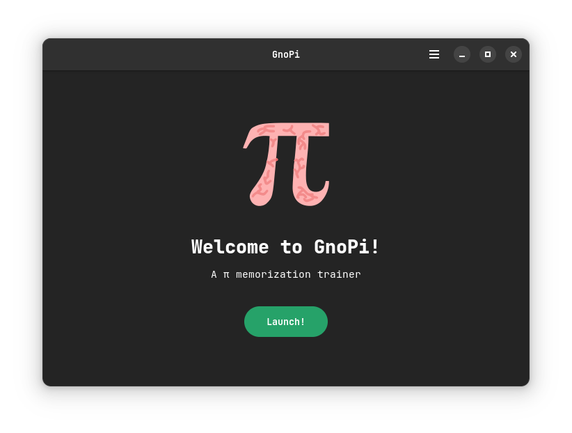
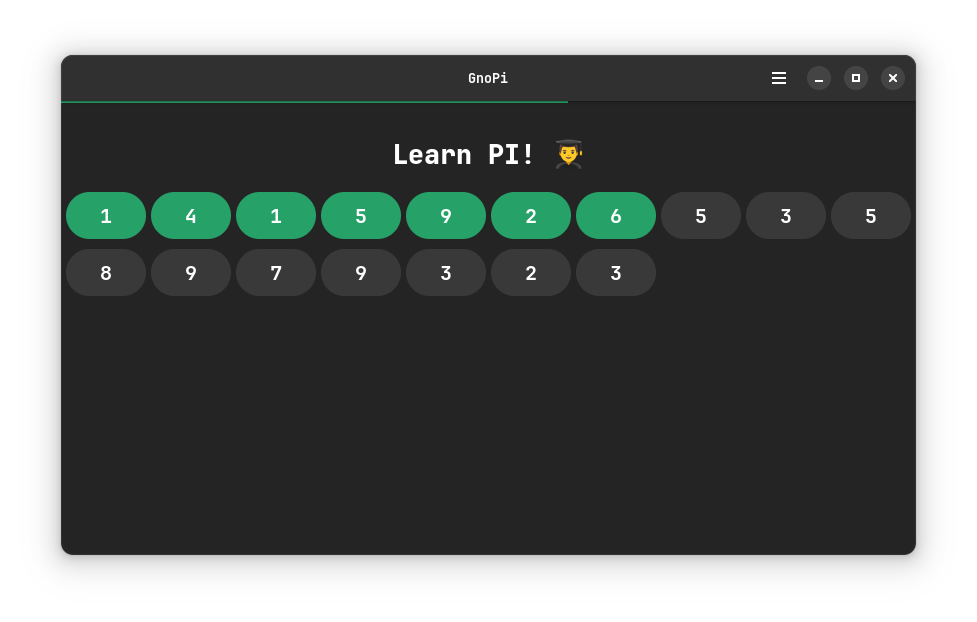
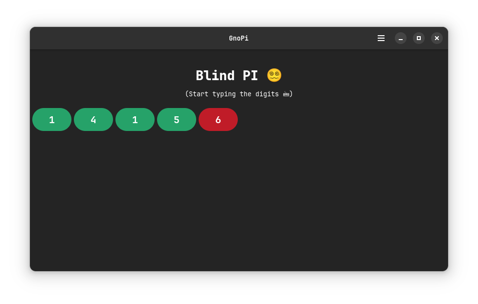
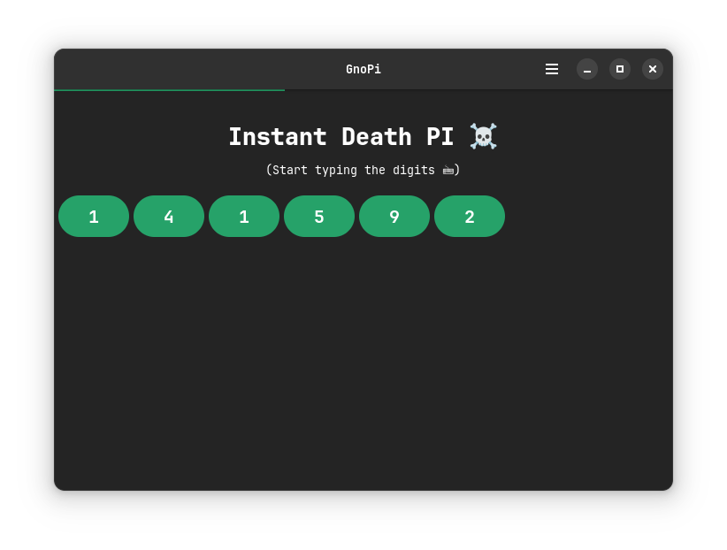

# [GnoPi]::A π memorization trainer

## Demo

<table>
  <tr>
    <td></td>
    <td></td>
  </tr>
  <tr>
    <td></td>
    <td></td>
  </tr>
</table>

## Purpose

1. Have fun
2. Learn gtk4-rs with relm4 to make truly native linux apps (bye electron 🤢)
3. Learn some PI digits

## Install

Via cargo:

```bash
cargo build --release # the executable is then in the ./target/release folder
```

> An executable for **fedora 40** can be found in the release page

## Limitation and Improvement

This app is a personal side-project, thus it may or may not lack rigor in its code. And may have (a lot) of bugs

There is a lot a features that can be implemented or improved such as a score system, a "save my progression/game" system, more mode or functionalities.

However to keep this project simple I'll stop there because my main goal was to learn relm4.

Also this app is limited to **1 million pi digits**, this should not be a problem (except if you're this kind of person to know 1 million digits aka a monster), however I did not think about the problems of bounds at these high indexes...

## Made with

- Elegance ✨
- Rust 🦀
- Relm4 🤎 (which imply gtk4-rs)
